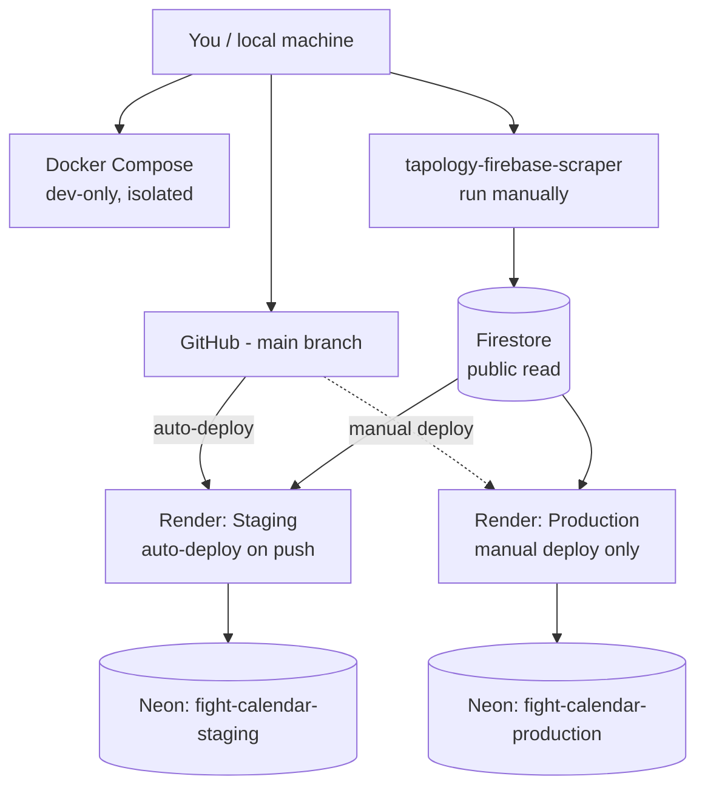

# Fight Calendar API

Read-only JSON API aggregating upcoming combat sports events (UFC, ONE, RIZIN, BKFC, and other tracked promotions), scraped from [Tapology](https://www.tapology.com). Built to be the shared backend for whatever frontends come later (web, mobile, Telegram bot) rather than bundled with any one of them.

## Architecture



## Tech stack

| Layer | Technology |
|---|---|
| API | ASP.NET Core 10, Web API only (no server-rendered UI) |
| ORM / migrations | EF Core + Npgsql |
| Database | PostgreSQL, hosted on [Neon](https://neon.tech) - one project per environment |
| Hosting | [Render](https://render.com), Docker-based Web Services |
| Event data source | Firebase Firestore, fed by a separate scraper project |
| API docs | Swagger / OpenAPI at `/swagger` (Staging only, disabled in Production) |

## Why two databases, and why Firestore?

**Two Postgres databases (Staging + Production), never shared.** A migration or test run against Staging must never be able to touch real data. Each environment is a fully separate Neon project with its own connection string - see [Deployments](#deployments) below.

**Firestore is not "our" database - it's a landing zone.** The actual scraping happens in a separate project, [`tapology-firebase-scraper`](https://github.com/T3mon/Tapology-firebase-scraper) (Node.js), which someone runs manually (or on a schedule) on any machine. It writes raw scraped events into a shared Firebase Firestore project (`fightfinder-8eb4b`) with public read rules - no credentials needed to read it. This API's `EventSyncService` (see `Services/Sync`) reads that raw feed over Firestore's public REST API and normalizes it into the real queryable schema here (`Promotions`, `Events`, `Fighters`, `Bouts`). Both Staging and Production read from the *same* Firestore project independently every 12 hours - the raw event data itself doesn't need duplicating per environment, only the normalized copies in Postgres do.

## Project layout

- `Controllers/Api` - the actual JSON endpoints (`/api/events`, `/api/promotions`)
- `Models/Domain` - EF Core entities (Promotion, Fighter, Event, Bout, UserFollow)
- `Models/Api` - response DTOs
- `Services/Firestore` - reads and parses the raw Firestore feed
- `Services/Sync` - transforms that feed and upserts it into Postgres
- `Data/ApplicationDbContext.cs` - EF Core context
- `Migrations/` - schema history

> Note: this project was scaffolded from ASP.NET Core's MVC + Identity template, and some of that (`Views/`, `Areas/Identity`, `HomeController`, `wwwroot/lib`) is still present but unused now that this is API-only. Pending cleanup - safe to ignore for now, safe to delete later.

## Local development

Prerequisites: [.NET 10 SDK](https://dotnet.microsoft.com/download), [Docker Desktop](https://www.docker.com/products/docker-desktop/), the `dotnet-ef` tool (`dotnet tool install --global dotnet-ef`).

```bash
git clone https://github.com/T3mon/fight-calendar-api.git
cd fight-calendar-api

# Start a local, throwaway Postgres (isolated - not Neon, not shared with anyone)
docker compose up -d postgres

# Apply the schema
cd src/FightCalendar.Web
dotnet ef database update

# Run it
dotnet run
```

Visit `http://localhost:5080/swagger` (port comes from `Properties/launchSettings.json`) to browse and test the API.

## Environment variables

| Variable | Purpose | Example |
|---|---|---|
| `ConnectionStrings__DefaultConnection` | Postgres connection string (Npgsql format, not a URL) | `Host=...;Port=5432;Database=...;Username=...;Password=...;Ssl Mode=Require` |
| `ASPNETCORE_ENVIRONMENT` | Which environment this instance is | `Development`, `Staging`, or `Production` |
| `Cors__AllowedOrigins` | Frontend origins allowed to call the API | `["http://localhost:5173"]` |

`Firestore:ProjectId` and `Firestore:CollectionName` are already set in `appsettings.json` (not secret - it's a public-read project) and don't need overriding.

## Deployments

| Environment | URL | Deploy trigger | Database |
|---|---|---|---|
| Staging | `fight-calendar-api-staging.onrender.com` | Automatic, on every push to `main` | Neon project `fight-calendar-staging` |
| Production | `fight-calendar-api-production.onrender.com` | Manual - click "Deploy" in the Render dashboard | Neon project `fight-calendar-production` |

Both run on Render's free tier - the first request after ~15 minutes of inactivity takes 30-50 seconds while the instance wakes up.

**Applying a new migration to a live database** is a manual step, not part of any deploy - run this locally against the target environment's connection string:

```bash
dotnet ef database update --connection "<that environment's connection string>"
```

## Related repositories

- [T3mon/Tapology-firebase-scraper](https://github.com/T3mon/Tapology-firebase-scraper) - populates the shared Firestore project this API reads from
